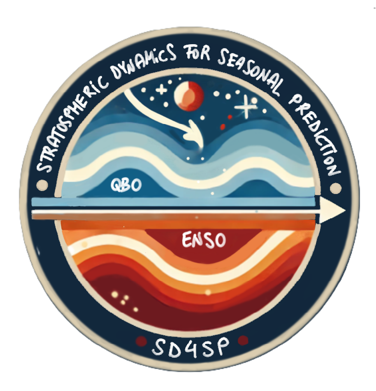

I completed my PhD in Physics at the Universidad Complutense de Madrid in 2018. My dissertation was entitled *Sudden Stratospheric Warmings and the Brewer-Dobson Circulation: diagnostics and interactions*. I next expanded my research on stratospheric dynamics and climate modelling at the Barcelona Supercomputing Center and later at the University of Barcelona, where I was also teaching and supervising Master students.

In 2022, I was awarded a **Marie Skłodowska-Curie** global fellowship to join the Euro-Mediterranean Center on Climate Change (CMCC) in Italy and develop my personal project **SD4SP** (Stratospheric Dynamics for Seasonal Prediction), to understand and quantify the role of El Niño Southern Oscillation (ENSO) and the Quasi-Biennial Oscillation (QBO) as sources of predictability in seasonal forecasting. I am a long-term visitor at the Canadian Centre for Climate Modelling and Analysis (CCCma) in Victoria, Canada, where the outgoing phase of the project takes place.

My main area of interest is stratosphere-troposphere dynamics, including climate variability and predictability, global circulation patterns and their impacts on the surface as well as their representation in climate models.

---

### [SD4SP: Stratospheric Dynamics for Seasonal Prediction](sd4sp_project.qmd){style="text-decoration: none; color: inherit;"} {width="150px" fig-align="right"}

SD4SP is a personal project funded by the European Commission in the **Marie Skłodowska-Curie Actions** framework. It aims to disentangle the mechanisms of atmospheric teleconnections via the stratosphere in order to improve seasonal forecasts. 

