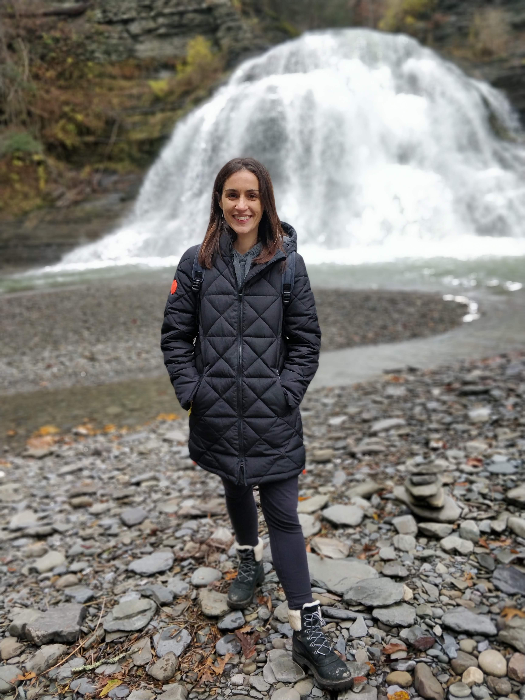
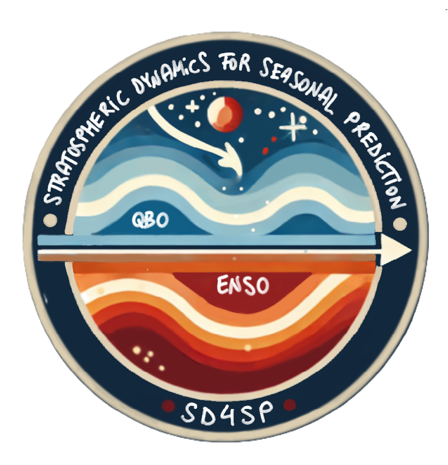
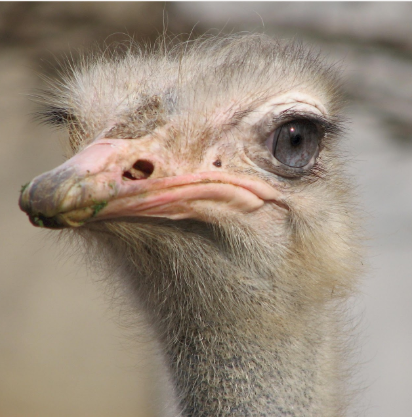

---
format:
  html:
    page-layout: article
---

  <h1 style="font-size: 3em; font-weight: 700; color: #2c3e50; margin-bottom: 0;">Froila M. Palmeiro</h1>
  
Climate Researcher

  

::: {style="text-align: center; margin-bottom: 40px;"}

::: {style="display: flex; justify-content: center; gap: 30px; font-size: 1.2em;"}
[<i class="bi bi-github"></i> GitHub](https://github.com/Froila-science){style="text-decoration: none; color: #2c3e50;"}
[<i class="bi bi-envelope"></i> Contact](mailto:froila.palmeiro@csic.es){style="text-decoration: none; color: #2c3e50;"}
[<i class="bi bi-mortarboard"></i> Research](sd4sp_project.qmd){style="text-decoration: none; color: #2c3e50;"}
:::
:::

::: {style="max-width: 800px; margin: 0 auto; text-align: justify; line-height: 1.6;"}
I completed my PhD in Physics at the Universidad Complutense de Madrid in 2018. My dissertation was entitled *Sudden Stratospheric Warmings and the Brewer-Dobson Circulation: diagnostics and interactions*. I next expanded my research on stratospheric dynamics and climate modelling at the Barcelona Supercomputing Center and later at the University of Barcelona, where I was also teaching and supervising Master students.

In 2022, I was awarded a **Marie Skłodowska-Curie** global fellowship to join the Euro-Mediterranean Center on Climate Change (CMCC) in Italy and develop my personal project **SD4SP** (Stratospheric Dynamics for Seasonal Prediction), partly at the Canadian Centre for Climate Modelling and Analysis (CCCma) in Victoria, where the outgoing phase of the project was developed. 

I recently joined the **Institute of Geosciences (IGEO) CSIC-UCM** to continue my research on stratosphere-troposphere dynamics, including climate variability and predictability, global circulation patterns and their impacts on the surface as well as their representation in climate models.
:::

 

::: {style="max-width: 850px; margin: 40px auto; background-color: #f8f9fa; padding: 30px; border-radius: 15px; border-left: 5px solid #3b82f6;"}

### [Project SD4SP](sd4sp_project.qmd){style="text-decoration: none; color: #3b82f6;"}

SD4SP is a personal project funded by the European Commission under the **Marie Skłodowska-Curie Actions** (GA-101065820). It aims to disentangle atmospheric teleconnections via the stratosphere to improve seasonal forecasts.

::: {style="display: flex; justify-content: center; gap: 30px; margin-top: 20px;"}
{height="80px"}
{height="80px"}
:::

:::

 

::: {style="text-align: center; margin-bottom: 30px;"}
### Work
:::

::: {layout-ncol="3"}
::: {style="text-align: center;"}
#### [Publications](publications.qmd){style="text-decoration: none; color: #2c3e50;"}

:::

::: {style="text-align: center;"}
#### [Software](https://github.com/Froila-science){style="text-decoration: none; color: #2c3e50;"}

:::

::: {style="text-align: center;"}
#### [Scientific Qs](sd4sp_project.qmd){style="text-decoration: none; color: #2c3e50;"}

:::
:::

  More results to come soon...

