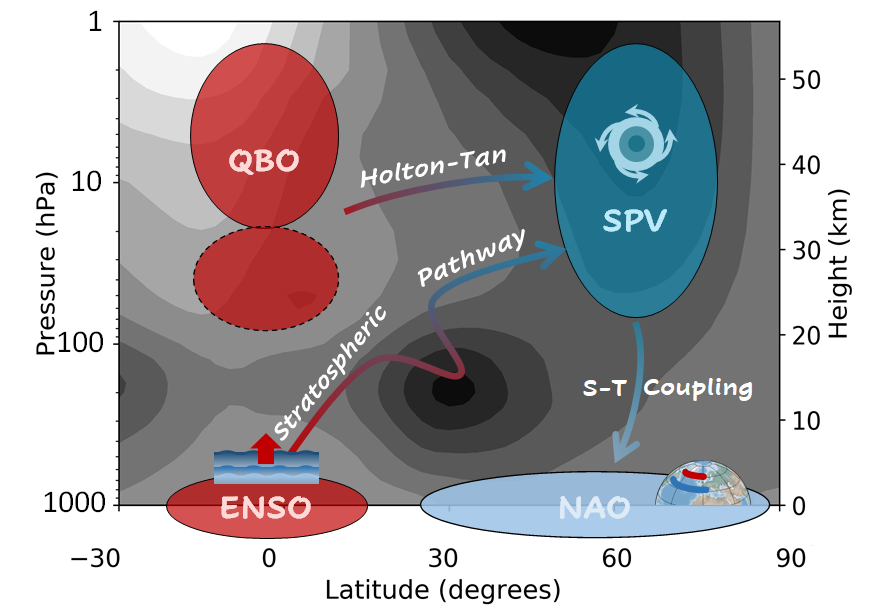
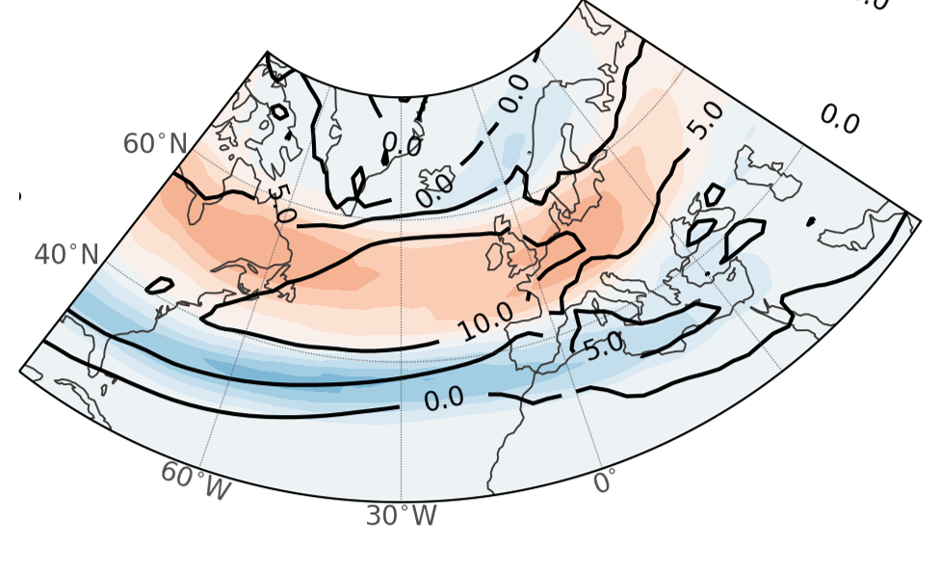
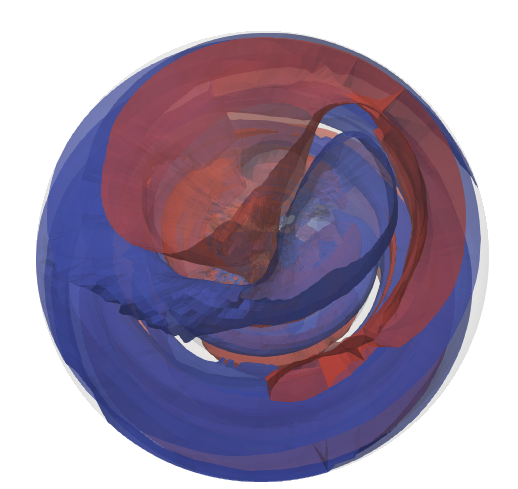
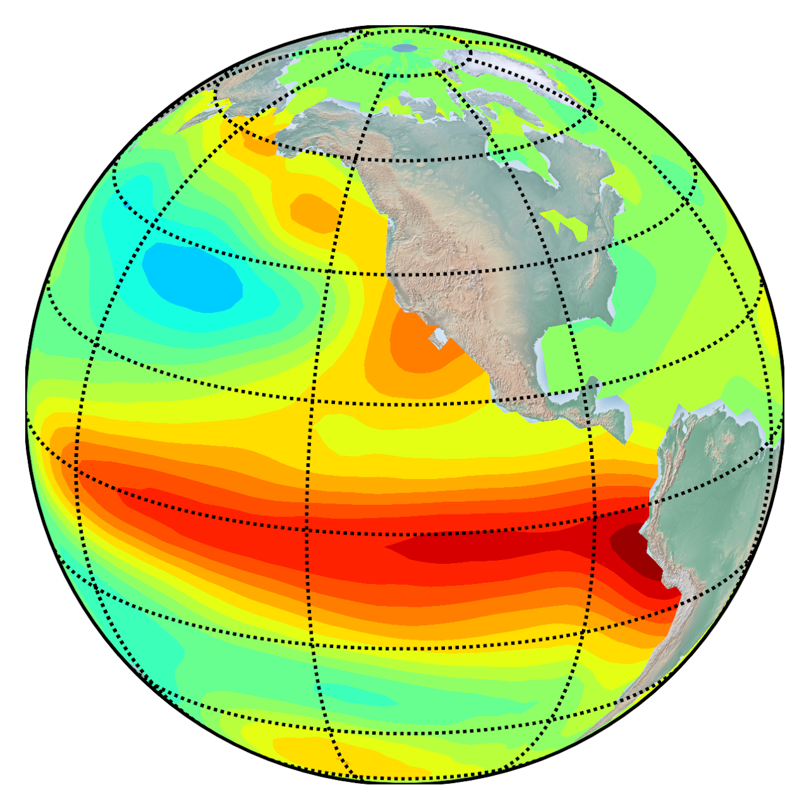
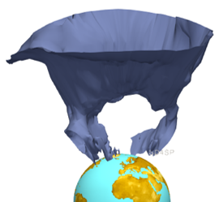
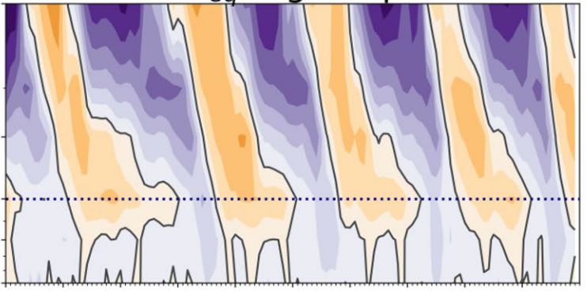
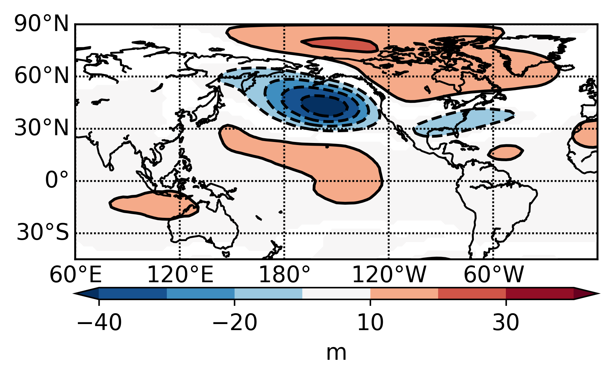

::: {.column-screen-inset-shaded style="padding: 30px; margin-bottom: 60px; border-bottom: 1px solid #eee;"}
::: {layout="[60,30]" style="align-items: center;"}

::: {#title-area style="text-align: center;"}
# SD4SP Project
### *____________________Stratospheric Dynamics for Seasonal*  
### *____________________Prediction*
:::

::: {#logo-area style="text-align: right; margin-left: 1px"}
{height="90px"}
:::

:::
:::

## Project Overview

The **SD4SP Project** focuses on the mechanisms of stratosphere-troposphere coupling. Particularly the impacts of El Niño – Southern Oscillation (ENSO) and the Quasi-Biennial Oscillation (QBO) over the [North Atlantic – European (NAE) region](nae.qmd) through their teleconnection via the stratosphere. The aim of SD4SP is to identify these mechanisms to improve their representation in climate models.

::: {style="text-align: center; margin-top: 30px;"}
{width="80%"}
:::

---

## Interactive Diagnostic Tools

::: {.grid}
::: {.g-col-12 .g-col-md-6}
### [🌪️ SSW Diagnostic Tool](ssw_app.qmd){style="text-decoration: none; color: #2c3e50;"}
Full-page tool to identify Sudden Stratospheric Warming events and analyze their downward propagation.
:::

::: {.g-col-12 .g-col-md-6}
### [📈 QBO Analysis Tool](app.qmd){style="text-decoration: none; color: #2c3e50;"}
Interactive dashboard to explore the Quasi-Biennial Oscillation phases and its relationship with the polar vortex.
:::
:::

---

## Research Topics

::: {.grid}

::: {.g-col-12 .g-col-md-4 style="text-align: center; margin-bottom: 30px;"}
[**North Atlantic European (NAE)**](nae.qmd){style="text-decoration: none; color: #2c3e50;"}
[{width="85%"}](nae.qmd)
*Exploring regional climate variability and storm tracks.*
:::

::: {.g-col-12 .g-col-md-4 style="text-align: center; margin-bottom: 30px;"}
[**Extreme Stratospheric Events (ESEs)**](ssws.qmd){style="text-decoration: none; color: #2c3e50;"}
[{width="85%"}](ssws.qmd)
*Analysis of weak and strong events (SSWs and SPVs).*
:::

::: {.g-col-12 .g-col-md-4 style="text-align: center; margin-bottom: 30px;"}
[**ENSO**](enso.qmd){style="text-decoration: none; color: #2c3e50;"}
[{width="85%"}](enso.qmd)
*El Niño – Southern Oscillation and its remote impacts.*
:::

::: {.g-col-12 .g-col-md-4 style="text-align: left; margin-bottom: 30px;"}
[**Polar Vortex**](stratospheric_variability.qmd){style="text-decoration: none; color: #2c3e50;"}
[{width="85%"}](stratospheric_variability.qmd)
*Dynamics of the winter stratospheric polar jet.*
:::

::: {.g-col-12 .g-col-md-4 style="text-align: left; margin-bottom: 30px;"}
[**QBO**](qbo.qmd){style="text-decoration: none; color: #2c3e50;"}
[{width="85%"}](qbo.qmd)
*The Quasi-Biennial Oscillation and its tropical-extratropical coupling.*
:::

::: {.g-col-12 .g-col-md-4 style="text-align: left; margin-bottom: 30px;"}
[**Teleconnections**](teleconnections.qmd){style="text-decoration: none; color: #2c3e50;"}
[{width="85%"}](teleconnections.qmd)
*Atmospheric bridges connecting different regions.*
:::

:::

  More results to come soon...

