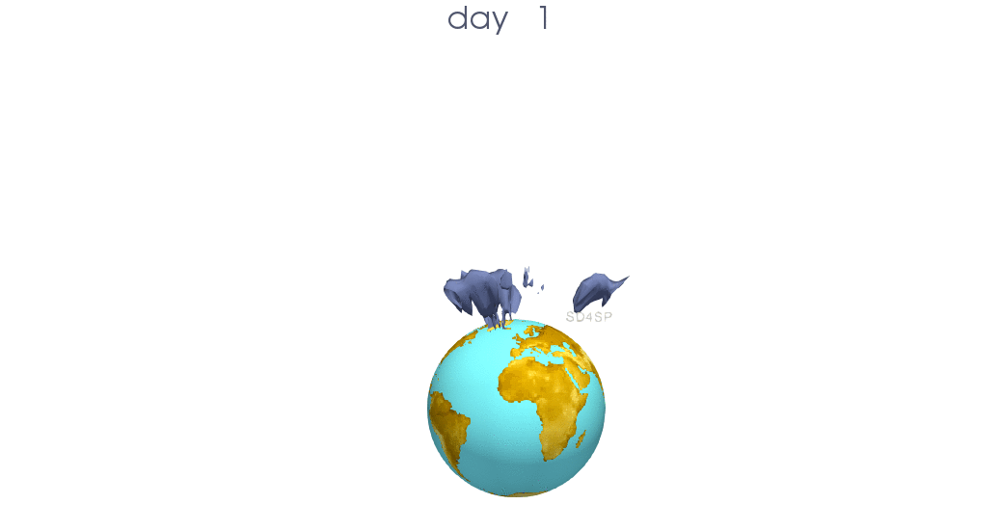
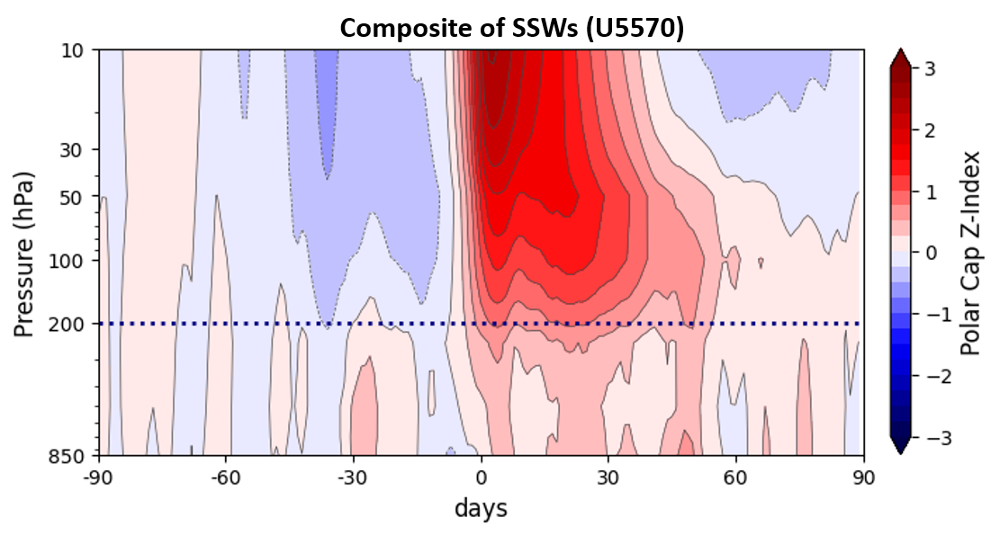

[← Back to Project Overview](sd4sp_project.html)

---

## The Stratospheric Polar Vortex (SPV)

The **Stratospheric Polar Vortex** is a large-scale cyclone of low-pressure cold air enclosed by westerly winds that forms high above the Arctic (and Antarctic) during the autumn and winter months. It is located in the stratosphere, roughly between 10 and 50 km in altitude. 

The strength of this vortex is a key driver of winter weather in the Northern Hemisphere. A strong, stable vortex tends to keep cold Arctic air bottled up at high latitudes, while a weak or disturbed vortex allows that cold air to spill southward into Europe and North America.

  {width="85%"}
  
Evolution of the stratospheric polar vortex during a typical winter season.

---

## Sudden Stratospheric Warmings (SSW)

A **Sudden Stratospheric Warming** is one of the most dramatic events in the atmosphere. In just a few days, the polar stratospheric temperature can increase by more than 50 K, and the strong westerly winds of the polar vortex can reverse to easterly.

  

    ### Downward Propagation
    The critical aspect for seasonal prediction is the **downward propagation**. When the stratospheric vortex breaks down or weakens significantly, the anomalies can migrate down to the troposphere, often shifting the North Atlantic storm track southwards and inducing a negative phase of the NAO.
  

  

    {width="100%"}
  

---

## Some remarkable events

Below are the historical records of the most significant events analyzed in the **SD4SP** project, categorized by their nature.

### 🌪️ Major Sudden Stratospheric Warmings (SSW)
These events are characterized by a full reversal of the zonal mean westerly winds at 10hPa and 60°N.
Some impactfull events are the following:

| Date of Onset | Type of Event | Duration (days) | Surface Impact |
|:--- |:--- |:--- |:--- |
| **Jan 2021** | Displacement | ~25 | Strong cold outbreaks in Europe |
| **Feb 2018** | Split | ~30 | "Beast from the East" |
| **Jan 2013** | Displacement | ~20 | Wet conditions in Iberia |
| **Jan 2009** | Split (Historical) | >40 | Persistent NAO- phase |
| **Dec 2001** | Displacement | ~15 | Moderate cooling |

[A complete list of sudden stratospheric warmings can be found here](ssws.html)
---
[SSWs can be computed interactively with our tool](ssw_app.qmd)

### 🌀 Strong Polar Vortex (SPV) Events
Unlike SSWs, these events represent an exceptionally strong and cold polar vortex, often leading to a very positive NAO phase and milder, stormier winters in Northern Europe.
Some impactfull events are the following:

| Winter Season | Intensity (Max Wind) | Resulting Pattern |
|:--- |:--- |:--- |
| **2019/2020** | Record Strength | Extremely Positive NAO+ |
| **2010/2011** | High | Stormy Northern Europe |
| **1996/1997** | High | Persistent Westerlies |
| **1988/1989** | Moderate-High | Milder winter in Mid-latitudes |

[A complete list of strong polar vortex events can be found here](spvs.html)
---
[SSWs can be computed interactively with our tool](ssw_app.qmd)

---

## Dynamics: SPV vs SSW

Understanding the lifecycle of these events is key to our research. While **SSWs** often lead to atmospheric "blocking" and cold air outbreaks, **Strong Polar Vortex** events tend to "trap" the cold air at the pole, strengthening the jet stream and bringing warmer, wetter weather to Western Europe.

---

  *Data derived from ERA5 Reanalysis and analyzed within the SD4SP framework.*

